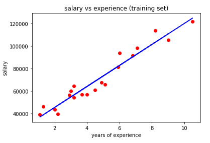
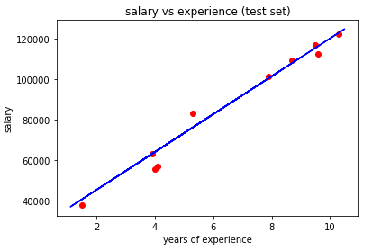

# Linear_regression
Simple linear regression model on a salary based on years of experience's dataset

Simple linear regression is useful for finding relationship between two continuous variables. One is predictor or independent variable and other is response or dependent variable. It looks for statistical relationship but not deterministic relationship

clone the repo and run:
    
    Python simple_lin_reg.py
    
Here is the expected output for the  training set:

And the expected output for the  test set:

For more details:

https://towardsdatascience.com/linear-regression-detailed-view-ea73175f6e86
